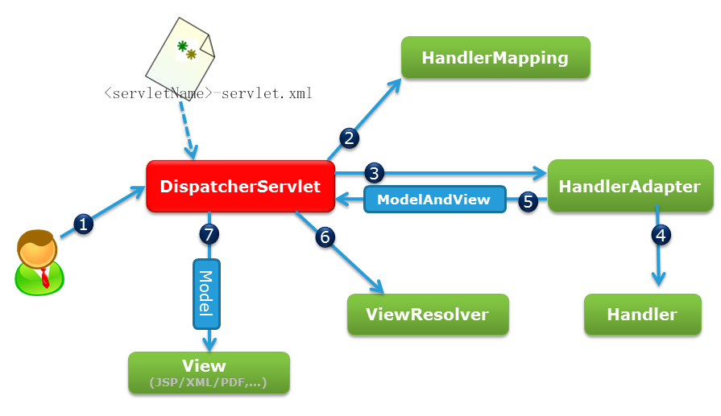

# 001.SpringMVC框架

## 一、SpringMVC框架介绍

1) spring MVC属于SpringFrameWork的后续产品，已经融合在Spring Web Flow里面。

Spring 框架提供了构建 Web 应用程序的全功能 MVC 模块。使用 Spring 可插入的 MVC 架构，可以选择是使用内置的 Spring Web 框架还是 Struts 这样的 Web 框架。通过策略接口，Spring 框架是高度可配置的，而且包含多种视图技术，例如 JavaServer Pages（JSP）技术、Velocity、Tiles、iText 和 POI。Spring MVC 框架并不知道使用的视图，所以不会强迫您只使用 JSP 技术。

Spring MVC 分离了控制器、模型对象、分派器以及处理程序对象的角色，这种分离让它们更容易进行定制。

2) Spring的MVC框架主要由DispatcherServlet、处理器映射、处理器(控制器)、视图解析器、视图组成。

## 二、SpringMVC原理图

## 三、SpringMVC接口解释

* DispatcherServlet接口：

Spring提供的前端控制器，所有的请求都有经过它来统一分发。在DispatcherServlet将请求分发给Spring Controller之前，需要借助于Spring提供的HandlerMapping定位到具体的Controller。

* HandlerMapping接口：

能够完成客户请求到Controller映射。

* Controller接口：

需要为并发用户处理上述请求，因此实现Controller接口时，必须保证线程安全并且可重用。

Controller将处理用户请求，这和Struts Action扮演的角色是一致的。一旦Controller处理完用户请求，则返回ModelAndView对象给DispatcherServlet前端控制器，ModelAndView中包含了模型（Model）和视图（View）。

从宏观角度考虑，DispatcherServlet是整个Web应用的控制器；从微观考虑，Controller是单个Http请求处理过程中的控制器，而ModelAndView是Http请求过程中返回的模型（Model）和视图（View）。

* ViewResolver接口：

Spring提供的视图解析器（ViewResolver）在Web应用中查找View对象，从而将相应结果渲染给客户。

## 四、SpringMVC运行原理

1、客户端发出一个http请求给web服务器，web服务器对http请求进行解析，如果匹配DispatcherServlet的请求映射路径（在web.xml中指定），web容器将请求转交给DispatcherServlet.

2、DipatcherServlet接收到这个请求之后将根据请求的信息（包括URL、Http方法、请求报文头和请求参数Cookie等）以及HandlerMapping的配置找到处理请求的处理器（Handler）。

3-4、DispatcherServlet根据HandlerMapping找到对应的Handler,将处理权交给Handler（Handler将具体的处理进行封装），再由具体的HandlerAdapter对Handler进行具体的调用。

5、Handler对数据处理完成以后将返回一个ModelAndView()对象给DispatcherServlet。

6、Handler返回的ModelAndView()只是一个逻辑视图并不是一个正式的视图，DispatcherSevlet通过ViewResolver将逻辑视图转化为真正的视图View。

7、Dispatcher通过model解析出ModelAndView()中的参数进行解析最终展现出完整的view并返回给客户端。

DispatcherServlet是整个Spring MVC的核心。它负责接收HTTP请求组织协调Spring MVC的各个组成部分。其主要工作有以下三项：

1. 截获符合特定格式的URL请求。

2. 初始化DispatcherServlet上下文对应的WebApplicationContext，并将其与业务层、持久化层的WebApplicationContext建立关联。

3. 初始化Spring MVC的各个组成组件，并装配到DispatcherServlet中。

