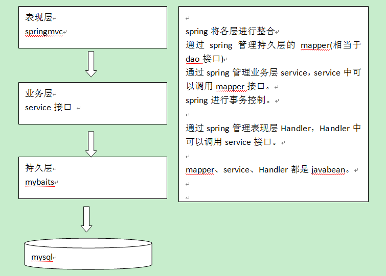

# 003.SpringMVC和MyBatis整合

## 一、整合思路

SpringMVC和MyBatis系统架构

* 第一步：整合dao层

mybatis和spring整合，通过spring管理mapper接口。
	
使用mapper的扫描器自动扫描mapper接口在spring中进行注册。

* 第二步：整合service层
s
通过spring管理 service接口。
	
使用配置方式将service接口配置在spring配置文件中。

实现事务控制。

* 第三步：整合springmvc

由于springmvc是spring的模块，不需要整合。

## 二、整合dao

### 1.sqlMapConfig.xml

		<?xml version="1.0" encoding="UTF-8" ?>
		<!DOCTYPE configuration
		PUBLIC "-//mybatis.org//DTD Config 3.0//EN"
		"http://mybatis.org/dtd/mybatis-3-config.dtd">
		<configuration>
			
			<!-- 全局setting -->
			
			<!-- 自定义别名 -->
			<typeAliases>
				<!-- 
					批量别名定义
					指定包名，MyBatis自动扫描包中的po类，自动定义别名，别名就是类名（首字母大写或小写都可以）
				 -->
				 <package name="com.jimmy.ssm.po"/>
			</typeAliases>
			
			<!-- 
				配置mapper
				由于使用spring和mybatis的整合包进行mapper扫描，这里不需要配置了
				必须遵循：mapper.xml配置文件和mapper.java接口同名且在一个目录下
			 -->
		
		</configuration>

### 2.applicationContext-dao.xml

		<!-- 加载属性文件 -->
		<context:property-placeholder location="classpath:db.properties"/>
		
		<!-- 数据源 -->
		<bean id="dataSource" class="com.mchange.v2.c3p0.ComboPooledDataSource">
			<property name="user" value="${jdbc.username}"></property>
			<property name="password" value="${jdbc.password}"></property>
			<property name="driverClass" value="${jdbc.driver}"></property>
			<property name="jdbcUrl" value="${jdbc.url}"></property>
			
			<property name="initialPoolSize" value="${jdbc.initialPoolSize}"></property>
			<property name="maxPoolSize" value="${jdbc.maxPoolSize}"></property>
		</bean>
	
		<!-- sqlSessionFactory -->
		<bean id="sqlSessionFactory" class="org.mybatis.spring.SqlSessionFactoryBean">
			<!-- 数据源 -->
			<property name="dataSource" ref="dataSource"></property>
			<!-- mybatis配置文件 -->
			<property name="configLocation" value="classpath:mybatis/sqlMapConfig.xml"></property>
		</bean>
		
		<!-- mapper扫描器 -->
		<bean class="org.mybatis.spring.mapper.MapperScannerConfigurer">
			<property name="sqlSessionFactoryBeanName" value="sqlSessionFactory"></property>
			<property name="basePackage" value="com.jimmy.ssm.mapper"></property>
			
		</bean>
		
### 3.MBG逆向工程生成po类、mapper映射文件、mapper接口

### 4.自定义mapper映射文件、mapper接口

#### ItemsMapperCustom.xml

		<mapper namespace="com.jimmy.ssm.mapper.ItemsMapperCustom">
	
		<!-- 商品查询sql片段 -->
		<sql id="query_items_where">
			<!-- 动态sql -->
			<!-- 查询条件通过ItemsQueryVo包装对象中itemsCustom属性传递 -->
			<if test="itemsCustom != null">
				<if test="itemsCustom.name != null and itemsCustom.name != ''">
					items.name LIKE '%${itemsCustom.name}%'
				</if>
			</if>
		</sql>
		
		<!-- 
			商品查询
			parameterType传入包装类ItemsQueryVo
			resultType建议使用扩展类ItemsCustom
		 -->
		<select id="findItemsList" parameterType="ItemsQueryVo" resultType="ItemsCustom">
			SELECT items.* FROM items 
			<where>
				<include refid="query_items_where"></include>
			</where>
		</select>
	</mapper>

#### ItemsMapperCustom.java

		public interface ItemsMapperCustom {
			
			public List<ItemsCustom> findItemsList(ItemsQueryVo itemsQueryVo) throws Exception;
			
		}

## 二、整合service

让spring容器管理service接口

### 1.定义Serivce接口和实现

		public interface ItemsService {
			
			//商品信息查询
			public List<ItemsCustom> findItemsList(ItemsQueryVo itemsQueryVo) throws Exception;
			
		}
		
		public class ItemsServiceImpl implements ItemsService {
			
			@Autowired
			private ItemsMapperCustom itemsMapperCustom;
		
			@Override
			public List<ItemsCustom> findItemsList(ItemsQueryVo itemsQueryVo) throws Exception {
				return itemsMapperCustom.findItemsList(itemsQueryVo);
			}
		
		}

### 2.在spring容器配置service

创建applicationContext-service.xml 并配置service bean

		<!-- 商品管理serivce -->
		<bean id="itemsService" class="com.jimmy.ssm.service.impl.ItemsServiceImpl"></bean>

### 3.事务控制

创建applicaitonContext-tx.xml

		<!-- 事务管理 -->
		<bean id="transactionManager" class="org.springframework.jdbc.datasource.DataSourceTransactionManager">
			<!-- 数据源 配置在applicationContext-dao.xml之中 -->
			<property name="dataSource" ref="dataSource"></property>
		</bean>
		
		<!-- 通知 -->
		<tx:advice id="txAdvice" transaction-manager="transactionManager">
			<tx:attributes>
				<!-- 传播行为 -->
				<tx:method name="save*" propagation="REQUIRED"/>
				<tx:method name="delete*" propagation="REQUIRED"/>
				<tx:method name="insert*" propagation="REQUIRED"/>
				<tx:method name="update*" propagation="REQUIRED"/>
				
				<tx:method name="find*" propagation="SUPPORTS" read-only="true"/>
				<tx:method name="get*" propagation="SUPPORTS" read-only="true"/>
				<tx:method name="select*" propagation="SUPPORTS" read-only="true"/>
				
			</tx:attributes>
		</tx:advice>
		
		<!-- aop -->
		<aop:config>
			<aop:advisor advice-ref="txAdvice" pointcut="execution(* com.jimmy.ssm.service.*.*(..))"/>
		</aop:config>

## 三、整合springmvc

### 1.创建springmvc.xml文件，配置处理器映射器、处理器适配器、视图解析器

		<!-- 实际开发中使用组件扫描加载handler bean -->
		<context:component-scan base-package="com.jimmy.ssm.controller"></context:component-scan>
		
		<!-- 注解的处理器映射器 -->
		<!-- <bean class="org.springframework.web.servlet.mvc.method.annotation.RequestMappingHandlerMapping"></bean> -->
		
		<!-- 注解的处理器适配器 -->
		<!-- <bean class="org.springframework.web.servlet.mvc.method.annotation.RequestMappingHandlerAdapter"></bean> -->
	
		<!-- 
			使用<mvc:annotation-driven>代替上面的处理器映射器和处理器适配器配置
			默认加载很多的参数绑定方法，比如：json转换的解析器
			实际开发中建议使用
		 -->
		<mvc:annotation-driven></mvc:annotation-driven>
		
		<!-- 
			视图解析器
			解析jsp，默认使用jstl标签，确保导入了jstl的jar包
			prefix：视图url前缀
			suffix：视图url后缀
			配置前缀和后缀可以简化handler中视图指定的代码
				modelAndView.setViewName("items/itemsList");
		 -->
		<bean class="org.springframework.web.servlet.view.InternalResourceViewResolver">
			<!-- /WEB-INF/jsp/items/itemsList.jsp -->
			<property name="prefix" value="/WEB-INF/jsp/"></property>
			<property name="suffix" value=".jsp"></property>
		</bean>

### 2.配置前端控制器

web.xml中

		<!-- springmvc前端控制器DispatcherServlet -->
		<servlet>
			<servlet-name>springmvc</servlet-name>
			<servlet-class>org.springframework.web.servlet.DispatcherServlet</servlet-class>
			<!-- 
				contextConfigLocation：配置springmvc加载的配置文件（配置处理器映射器、处理器适配器等等）
				如果不配置contextConfigLocation，默认加载/WEB-INF/servlet名称-servlet.xml（springmvc-servlet.xml）
			 -->
			<init-param>
				<param-name>contextConfigLocation</param-name>
				<param-value>classpath:springmvc.xml</param-value>
			</init-param>
		</servlet>
	
		<servlet-mapping>
			<!-- 
				第一种：*.action，以.action结尾的访问 由DispatcherServlet进行解析
				第二种：/，所有访问的地址都由DispatcherServlet进行解析，对于静态文件的解析需要配置不让DispatcherServlet进行解析
					使用此种方式可以实现RESTful风格的url
			 -->
			<servlet-name>springmvc</servlet-name>
			<url-pattern>*.action</url-pattern>
		</servlet-mapping>

### 3.编写Controller（handler）

		@Controller
		public class ItemController {
			
			@Autowired
			private ItemsService itemsSerive;
			
			// @RequestMapping指定queryItems()方法和url的映射
			// 一般建议url和方法名一致
			@RequestMapping("/items/queryItems")
			public ModelAndView queryItems() throws Exception {
				
				//调用serivce
				List<ItemsCustom> itemsList = itemsSerive.findItemsList(null);
		
				// 返回ModelAndView
				ModelAndView modelAndView = new ModelAndView();
				// 相当于request的setAttribut方法，在jsp页面中通过itemsList取数据
				modelAndView.addObject("itemsList", itemsList);
		
				// 指定试图
				modelAndView.setViewName("items/itemsList");
				return modelAndView;
			}
		}

## 三、加载spring容器

web.xml配置

		<!-- 加载spring容器 -->
		<!-- needed for ContextLoaderListener -->
		<context-param>
			<param-name>contextConfigLocation</param-name>
			<param-value>
				/WEB-INF/classes/spring/applicationContext-*.xml
			</param-value>
		</context-param>
	
		<!-- Bootstraps the root web application context before servlet initialization -->
		<listener>
			<listener-class>org.springframework.web.context.ContextLoaderListener</listener-class>
		</listener>

