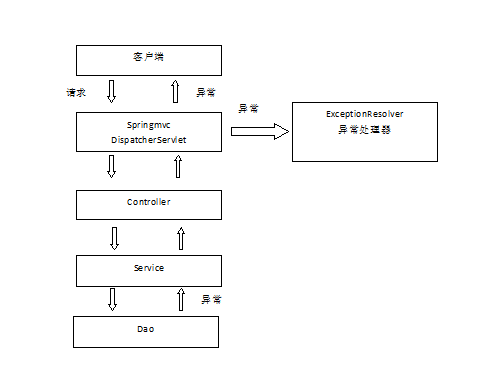

# 008.异常处理

## 一、异常处理思路

系统中异常包括两类：预期异常和运行时异常RuntimeException，前者通过捕获异常从而获取异常信息，后者主要通过规范代码开发、测试等手段减少运行时异常的发生。

系统的dao、service、controller出现异常都通过throws Exception向上抛出，最后由springmvc前段控制器交由异常处理器进行异常处理，如下图：

系统springmvc提供全局异常处理器（一个系统只有一个异常处理器）进行统一异常处理。

## 二、自定义异常类

对不同的异常类型定义异常类，继承Exception

		package com.jimmy.ssm.exception;
		
		public class CustomException extends Exception {
		
			//异常信息
			public String message;
		
			public CustomException(String message) {
				super();
				this.message = message;
			}
		
			public String getMessage() {
				return message;
			}
		
			public void setMessage(String message) {
				this.message = message;
			}
			
		}

## 三、全局异常处理器

思路：系统遇到异常，在程序中手动抛出，dao抛给service、service抛给controller、controller抛给前段控制器，前端控制器调用全局异常处理器大器。

全局异常处理器处理思路：

解析出异常类型

如果该异常类型是系统自定义的异常，直接取出异常信息，在错误页面展示

如果该异常类型不是自定义的异常，构造一个自定义的异常类型（信息为“未知错误”）

springmvc提供一个HandlerExceptionResolver接口

		public class CustomExceptionResolver implements HandlerExceptionResolver {
		
			@Override
			public ModelAndView resolveException(HttpServletRequest request, HttpServletResponse response, Object handler,
					Exception ex) {
		
				//参数中的handler就是处理器适配器要执行的handler对象（只有method）
				
		//		全局异常处理器处理思路：
		//		解析出异常类型
		//			如果该异常类型是系统自定义的异常，直接取出异常信息，在错误页面展示
		//			如果该异常类型不是自定义的异常，构造一个自定义的异常类型（信息为“未知错误”）
				CustomException customException = null;
				
				if (ex instanceof CustomException) {
					customException = (CustomException) ex;
				} else {
					customException = new CustomException("未知异常");
				}
				
				String message = customException.getMessage();
				
				ModelAndView modelAndView = new ModelAndView();
				//将错误信息传到页面
				modelAndView.addObject("message", message);
				//指向错误页面
				modelAndView.setViewName("error");
				
				return modelAndView;
			}
		
		}

## 四、在springmvc.xml配置全局异常处理器

		<!-- 
			全局异常处理器
			只要实现了HandlerExceptionResolver接口就是全局异常处理器
		 -->
		<bean class="com.jimmy.ssm.exception.CustomExceptionResolver"></bean>

## 五、异常测试

在controller、service、dao中任意一处抛出异常。

如果是程序中手动抛出的异常，在错误页面中显示自定义的异常信息，如果不是手动抛出的异常说明是一个运行时异常，在错误页面中只显示“未知错误”。

在商品修改的controller方法中抛出异常

		public String editItems(Model model, @RequestParam(value="id", required=true) Integer items_id) throws Exception{
			
			//调用service根据商品id查询商品信息
			ItemsCustom itemsCustom = itemsService.findItemsById(items_id);
			
			if (itemsCustom == null) {
				throw new CustomException("修改的商品信息不存在！");
			}

如果与业务功能有关的异常，建议在service中抛出异常
如果与业务功能无关的异常，建议在controller中抛出异常

		@Override
		public ItemsCustom findItemsById(Integer id) throws Exception {
			Items items = itemsMapper.selectByPrimaryKey(id);
			//对商品信息进行业务处理
			ItemsCustom itemsCustom = null;
			if (items != null) {
				itemsCustom = new ItemsCustom();
				//items的内容拷贝到itemsCustom
				BeanUtils.copyProperties(items, itemsCustom);
			} else {
				throw new CustomException("商品信息不存在！");
			}
			return itemsCustom;
		}

