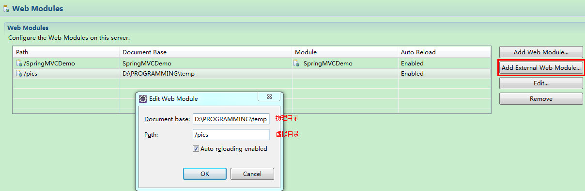

# 009.上传图片

## 一、需求

在修改商品页面，添加上传商品图片功能

## 二、依赖jar包

commons-fileupload-1.3.2.jar

commons-io-2.5.jar

http://commons.apache.org/proper/commons-fileupload/

http://commons.apache.org/proper/commons-io/

## 三、springmvc中对多部件类型解析

在页面form中提交enctype="multipart/form-data"的数据时，需要springmvc对multipart类型的数据进行解析。

在springmvc.xml中配置multipart类型解析器。

		<!-- 文件上传 -->
		<bean id="multipartResolver" 
			class="org.springframework.web.multipart.commons.CommonsMultipartResolver">
			<!-- 设置上传文件的最大尺寸5MB -->
			<property name="maxUploadSize">
				<value>5242800</value>
			</property>
		</bean>

## 四、创建图片虚拟目录存储图片

也可以直接修改tomcat配置文件conf/server.xml

<Context docBase="D:\PROGRAMMING\temp" path="/pics" reloadable="true"/>

注意：在图片虚拟目录中，一定将图片分级创建，以提高i/o性能。一般按照日期（年月日）进行分级创建。

一般会建单独的图片服务器储存图片

## 五、上传图片代码

* 修改商品修改controller方法

		//上传图片
		if (items_pic != null) {
			//原始图片名称
			String originalFilename = items_pic.getOriginalFilename();
			if (originalFilename != null && originalFilename != "") {
		
				//存储图片的屋里路径
				String pic_path = "D:\\PROGRAMMING\\temp\\";
				
				//新的图片名称
				String newFileName = UUID.randomUUID() + originalFilename.substring(originalFilename.lastIndexOf("."));
				//新图片文件
				File newFile = new File(pic_path + newFileName);
				
				//将内存中的数据写入磁盘
				items_pic.transferTo(newFile);
				
				//将新图片名称存入itemsCustom中
				itemsCustom.setPic(newFileName);
			}			
		}

* 修改商品修改jsp页面

		<form id="itemForm" action="${pageContext.request.contextPath}/items/eidtItemsSubmit.action" method="post" enctype="multipart/form-data">
		...

		<tr>
			<td>商品图片</td>
			<td>
				<c:if test="${itemsCustom.pic !=null}">
					
					 
				</c:if> 
				<input type="file" name="items_pic" />
			</td>
		</tr>
