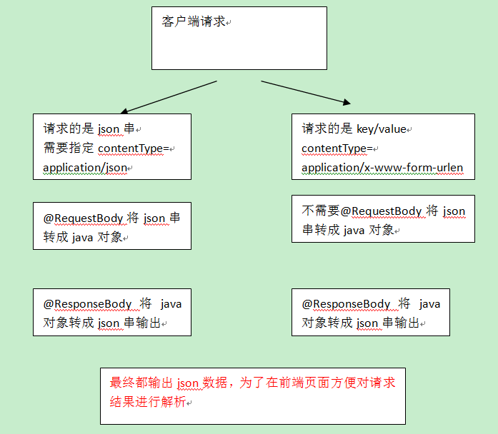

# 010.JSON数据交互

## 一、为什么要进行json数据交互

json数据格式在接口调用中、html页面中较常用，json格式比较简单，解析还比较方便。

比如：webservice接口，传输json数据

## 二、springmvc进行json交互

1、请求json、输出json，要求请求是json串，所以在前段页面中需要将请求的内容转成json，不方便。

2、请求时key/value、输出json。此方法比较常用。

## 三、环境准备

### 1.加入jackson jar包

springmvc中使用jackson进行json转换（@requestBody和@responseBody使用jackson）

* jackson-core-2.8.1.jar
* jackson-databind-2.8.1.jar
* jackson-annotations-2.8.0.jar

http://wiki.fasterxml.com/JacksonDownload

### 2.配置json转换器

在注解适配器中加入messageConverters

		<!--注解适配器 -->
		<bean class="org.springframework.web.servlet.mvc.method.annotation.RequestMappingHandlerAdapter">
			<property name="messageConverters">
			<list>
			<bean class="org.springframework.http.converter.json.MappingJacksonHttpMessageConverter"></bean>
			</list>
			</property>
		</bean>

注意：如果使用<mvc:annotation-driven /> 则不用定义上边的内容。

## 四、json交互测试

### 1.输入json、输出json

#### jsp页面

使用jquery的ajax提交json串，对controller方法输出的json结果进行解析

		
		<script type="text/javascript">
		/* 请求json，输出json */
		function requestJson(){
			
			$.ajax({
				type:'post',
				url:'${pageContext.request.contextPath }/requestJson.action',
				contentType:'application/json;charset=utf-8',//数据格式是json
				data:'{"name":"手机","price":999}',
				success:function(data){
					alert(data);
				}
			});
			
		}

#### controller方法

		/**
		 * 请求json（商品信息），返回json（商品信息）
		 * @RequestBody将请求的json转成ItemsCustom对象
		 * @ResponseBody将返回的ItemsCustom对象转成json
		 * @param itemsCustom
		 * @return
		 */
		@RequestMapping("/requestJson")
		private @ResponseBody ItemsCustom requestJson(@RequestBody ItemsCustom itemsCustom) {
			return itemsCustom;
		}

### 2.输入key/value、输出json

#### jsp页面

		/* 请求key/value，输出json */
		function responseJson(){
			
			$.ajax({
				type:'post',
				url:'${pageContext.request.contextPath }/responseJson.action',
				data:'name=手机&price=999',
				success:function(data){
					alert(data);
				}
			});
			
		}

#### controller方法

		/**
		 * 请求key/value，返回json
		 * @param itemsCustom
		 * @return
		 */
		@RequestMapping("/responseJson")
		private @ResponseBody ItemsCustom responseJson(ItemsCustom itemsCustom) {
			return itemsCustom;
		}
